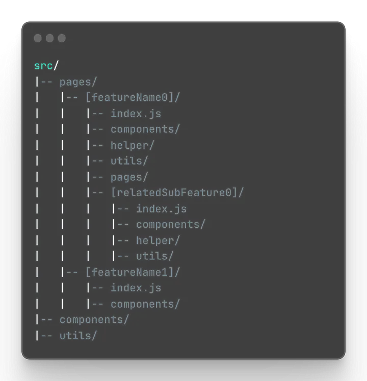

<div align="center">
    
    <h2><b>Vite: React + TypeScript + SCSS or CSS3</b></h2>
</div>

> This template provides a minimal setup to get React working in Vite with HMR and some ESLint rules.

❗ Please choose between `SCSS` or `CSS3` and remove the other from the project.

Currently, two official plugins are available:

- [@vitejs/plugin-react](https://github.com/vitejs/vite-plugin-react/blob/main/packages/plugin-react/README.md) uses [Babel](https://babeljs.io/) for Fast Refresh
- [@vitejs/plugin-react-swc](https://github.com/vitejs/vite-plugin-react-swc) uses [SWC](https://swc.rs/) for Fast Refresh

**Additional non-vite default dependencies:**

- "prop-types": "^15.8.1".
- "react-icons": "^4.11.0".
- "react-router-dom": "^6.15.0".

**Additional non-vite default dev-dependencies:**

- "eslint-plugin-react": "^7.33.2".
- "eslint-plugin-react-hooks": "^4.6.0".
- "eslint-plugin-react-refresh": "^0.4.5".
- "sass": "^1.66.1".
- "stylelint": "^13.13.1".
- "stylelint-config-standard": "^21.0.0".
- "stylelint-csstree-validator": "^1.9.0".
- "stylelint-scss": "^3.21.0".

---

<details>
  <summary>📂 Ideal File/Folder Structure</summary>



</details>

---

## Documentation Template

<a name="readme-top"></a>

<div align="center">
    
    <h2><b>[PROJECT_NAME]</b></h2>
</div>

---

<!-- ! TABLE OF CONTENTS -->

# 📗 Table of Contents

- [📖 About the Project](#about-project)
  - [🛠 Built With](#built-with) - [Tech Stack](#tech-stack)
  <!-- - [⚙️ Setting Up Environment Variables](#env-setup) -->
  - [Key Features](#key-features)
  - [🚀 Live Demo](#live-demo)
- [💻 Getting Started](#getting-started)
  - [Setup](#setup)
  - [Prerequisites](#prerequisites)
  - [Install](#install)
  - [Usage](#usage)
- [👥 Authors](#authors)
- [🔭 Future Features](#future-features)
- [🤝 Contributing](#contributing)
- [⭐️ Show your support](#support)
- [🙏 Acknowledgements](#acknowledgements)
- [📝 License](#license)

---

<!-- ! PROJECT DESCRIPTION -->

# 📖 [PROJECT_NAME] <a name="about-project"></a>

**[PROJECT_NAME]** .

> Project description.

---

## Learning objectives

- Learning objectives.

<p align="right">(<a href="#readme-top">back to top</a>)</p>

---

## 🛠 Built With <a name="built-with"></a>

### Tech Stack <a name="tech-stack"></a>

  <ul>
    <li>
      
      <a href="https://react.dev/">React.ts</a>
    </li>
    <li>
      
      <a href="https://www.typescriptlang.org/">TypeScript</a>
    </li>
    <li>
      
      <a href="https://sass-lang.com/">SCSS</a>
    </li>
    <li>
      
      <a href="https://developer.mozilla.org/en-US/docs/Web/CSS">CSS3</a>
    </li>
    <li>
      
      <a href="https://developer.mozilla.org/en-US/docs/Web/HTML">HTML</a>
    </li>
  </ul>

---

<!-- ! ENV SETUP -->

<!-- # ⚙️ Setting Up Environment Variables <a name="env-setup"></a>

In order to run this project, you'll need to set up your environment variables. We've provided a `.env_sample` file that you can use as a template. Follow these steps to configure your environment variables:

1. **Create a Copy of `.env_sample`**

   - Duplicate the `.env_sample` file and rename it to `.env`.

2. **Replace Placeholder Values**

   - Open the `.env` file in a text editor.
   - Replace the placeholder values (e.g., `YOUR_API_BASE_URL`, `YOUR_API_SIGNUP_ENDPOINT`, etc.) with your actual API details.

3. **Save the Changes**

   - Save the changes to the `.env` file.

4. **Usage in the Project**
   - The project will now automatically pick up the environment variables from the `.env` file during runtime.

### Important Notes:

- **Security:** Keep your `.env` file secure and never expose it publicly, as it may contain sensitive information.
- **Git Ignored:** Ensure that the `.env` file is listed in your `.gitignore` to prevent accidental commits of sensitive information.

<p align="right">(<a href="#readme-top">back to top</a>)</p> -->

<!-- --- -->

---

<!-- ! Features -->

### Key Features <a name="key-features"></a>

- **Feature 1:** Description of feature 1.

<p align="right">(<a href="#readme-top">back to top</a>)</p>

---

<!-- ! LIVE DEMO -->

## 🚀 Live Demo <a name="live-demo"></a>

- [Live Demo Link]()

<p align="right">(<a href="#readme-top">back to top</a>)</p>

---

<!-- ! GETTING STARTED -->

## 💻 Getting Started <a name="getting-started"></a>

To get a local copy up and running, follow these steps.

### Prerequisites

In order to run this project you need:

### Setup

Clone this repository to your desired folder:

Example commands:

- With SSH:

```bash
  cd my-folder
  git clone SSH-KEY-HERE
```

- With HTTPS:

```bash
  cd my-folder
  git clone HTTPS-LINK-HERE
```

- With GitHub CLI:

```bash
  cd my-folder
  gh repo clone GITHUB-USERNAME/REPO-NAME
```

### Install

Install this project's dependencies with:

```bash
  npm install
```

### Usage

To run the project, execute the following command:

```bash
 npm run dev
```

Runs the app in the development mode.\
Open [http://localhost:5173](http://localhost:5173) to view it in your browser.

The page will reload when you make changes.\
You may also see any lint errors in the console.

### Run Linters

#### > ESLint

```bash
  npx eslint "**/*.{ts,tsx}"
```

#### > Stylelint

```bash
  npx stylelint "**/*.{css,scss}"
```

<p align="right">(<a href="#readme-top">back to top</a>)</p>

---

<!-- ! AUTHORS -->

## 👥 Authors <a name="authors"></a>

👤 **Arthur Iturres**

- GitHub: [@ITurres](https://github.com/ITurres)
- LinkedIn: [Arthur Emanuel G. Iturres](https://www.linkedin.com/in/arturoemanuelguerraiturres/)
- Angellist / Wellfound: [Arturo (Arthur) Emanuel Guerra Iturres](https://wellfound.com/u/arturo-arthur-emanuel-guerra-iturres)
- Youtube: [Arturo Emanuel Guerra Iturres - Youtube Channel](https://www.youtube.com/channel/UC6GFUFHOtBS9mOuI8EJ6q4g)
- Portfolio: [Arthur Iturres - Portfolio](https://iturres.github.io/iturres-reactive-portfolio/)

<p align="right">(<a href="#readme-top">back to top</a>)</p>

---

<!-- ! FUTURE FEATURES -->

## 🔭 Future Features <a name="future-features"></a>

- [ ] **Feature 1:** Description of feature 1.

<p align="right">(<a href="#readme-top">back to top</a>)</p>

---

<!-- ! CONTRIBUTING -->

## 🤝 Contributing <a name="contributing"></a>

Contributions, issues, and feature requests are welcome!

Feel free to check the [issues page]().

<p align="right">(<a href="#readme-top">back to top</a>)</p>

---

<!-- ! SUPPORT -->

## 🙌 Show your support <a name="support"></a>

Give a ⭐ if you liked this project!

<p align="right">(<a href="#readme-top">back to top</a>)</p>

---

<!-- ! ACKNOWLEDGEMENTS -->

## 🙏 Acknowledgments <a name="acknowledgements"></a>

- Acknowledgments.

<p align="right">(<a href="#readme-top">back to top</a>)</p>

---

<!-- ! LICENSE -->

## 📝 License <a name="license"></a>

This project is [MIT](./LICENSE) licensed.

<p align="right">(<a href="#readme-top">back to top</a>)</p>

---
